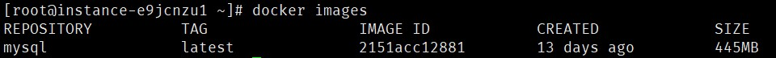
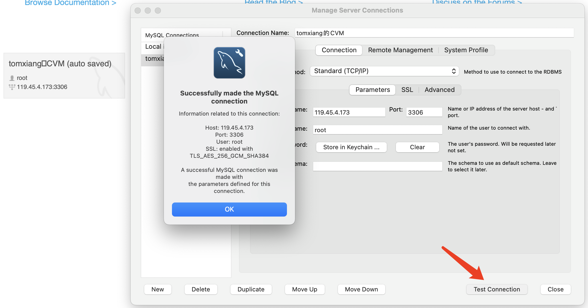
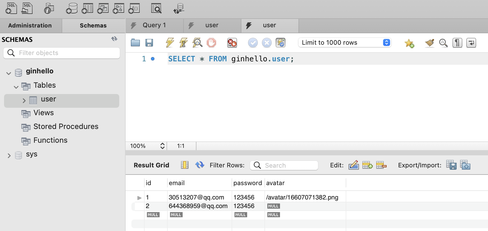

# 一. 文件路径
参考[彻底解决Golang获取当前项目绝对路径问题](https://tehub.com/a/44BceBfRK0)
```
// GetCurrentAbPath 最终方案-全兼容
func GetCurrentAbPath() string {
   dir := getCurrentAbPathByExecutable()
   tmpDir, _ := filepath.EvalSymlinks(os.TempDir())
   if strings.Contains(dir, tmpDir) {
      return "."
   }
   return dir
}

// getCurrentAbPathByExecutable 获取当前执行文件绝对路径
func getCurrentAbPathByExecutable() string {
   exePath, err := os.Executable()
   if err != nil {
      log.Fatal(err)
   }
   res, _ := filepath.EvalSymlinks(filepath.Dir(exePath))
   return res
}
```
# 二. 表单
## gin框架和表单绑定时模型要定义成这样
```
// UserModel SqlX框架去做数据分类
type UserModel struct {
   Id       int            `db:"id" form:"id"`
   Email    string         `db:"email" form:"email" binding:"email"`
   Password string         `db:"password" form:"password"`
   Avatar   sql.NullString `db:"avatar"`
}
```
binding是引入了validator10.0 ，这里是系统可自动校验email格式

# 三. 上传
上传只要提供本地路径，然后后台获取到路径之后，可使用gin框架进行保存
##  gin框架提供保存接口
```
// 3.保存文件
fileName := strconv.FormatInt(time.Now().Unix(), 10) + file.Filename
log.Println("tomxiang:保存的图片", fileName)
err = context.SaveUploadedFile(file, filepath.Join(path, fileName))
if err != nil {
   context.HTML(http.StatusOK, "error.tmpl", gin.H{
      "error": err,
   })
   log.Panicln("无法保存文件", err.Error())
}
```

# 四. 测试
自动化测试
```
// http://localhost:8000/user/?name=tom&age=33
func TestUserSaveNameAge(t *testing.T) {
	username := "lisi"
	age := 18
	w := httptest.NewRecorder()
	req := httptest.NewRequest(http.MethodGet, "/user/?name="+username+"&age="+strconv.Itoa(age), nil)
	userRouter.ServeHTTP(w, req)
	assert.Equal(t, http.StatusOK, w.Code)
	assert.Equal(t, "用户"+username+",年龄"+strconv.Itoa(age)+"已经保存", w.Body.String())
}
```

# 五. 中间件
```
// Logger 日志
func Logger() gin.HandlerFunc {
   return func(context *gin.Context) {
      host := context.Request.Host
      url := context.Request.URL
      method := context.Request.Method
      fmt.Printf("%s::%s \t %s \t %s ", time.Now().Format("2006-01-02 15:04:05"), host, url, method)
      context.Next()
      fmt.Println(context.Writer.Status())
   }
}
```
使用过程
```
userRouter.GET("/profile/", middleware.Auth(), service.UserProfile)
userRouter.POST("/update", middleware.Auth(), service.UpdateUserProfile)
```

# 六. 安装mysql容器
## 1. 下载镜像
```
docker search mysql
docker pull mysql
docker images
```


## 2. 跑容器
```
docker run -p 3306:3306 --name mysql -e MYSQL_ROOT_PASSWORD=1234 -d mysql
docker exec -it mysql /bin/sh
mysql -u root -p
输入密码进入之后
create database ginhello
``` 

## 3. 连接数据库




# 参考网站
1. [项目ISLAND的上手文档](https://youngxhui.top/categories/gin/)


